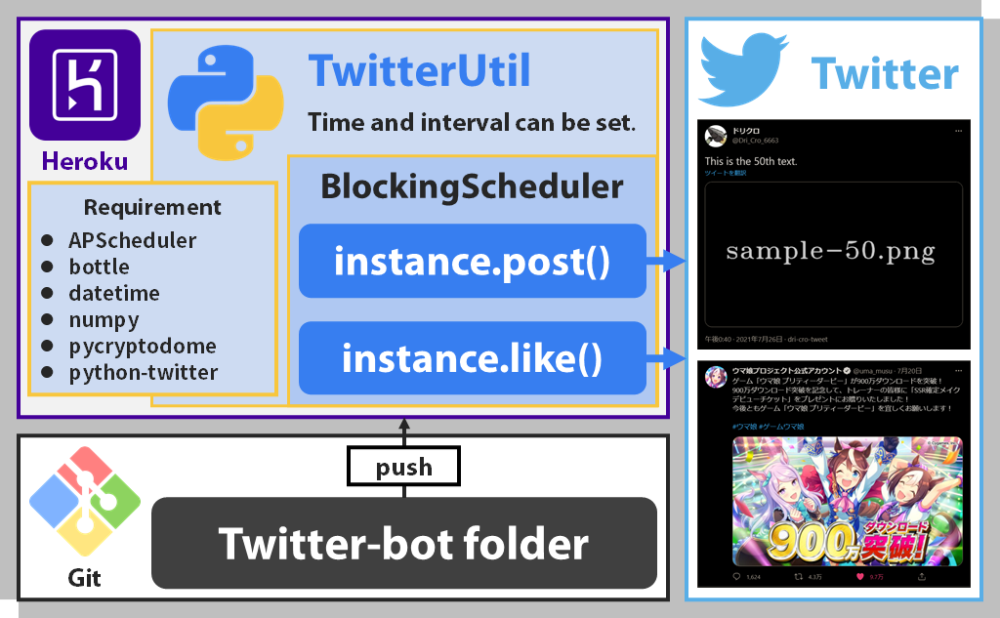
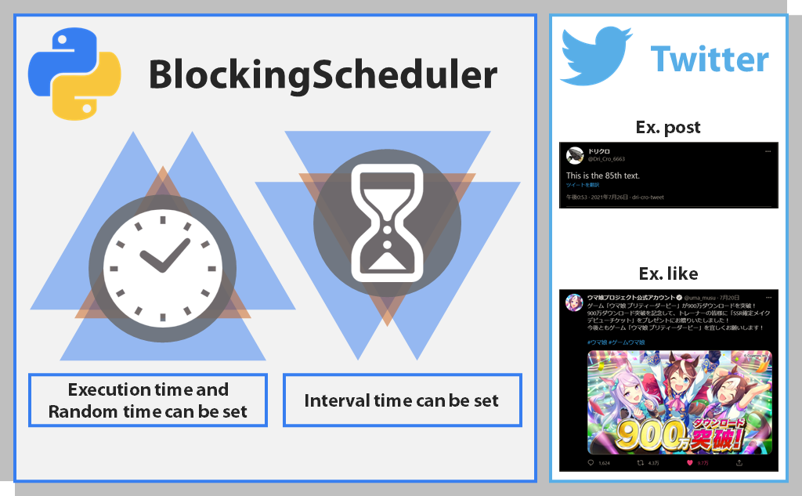
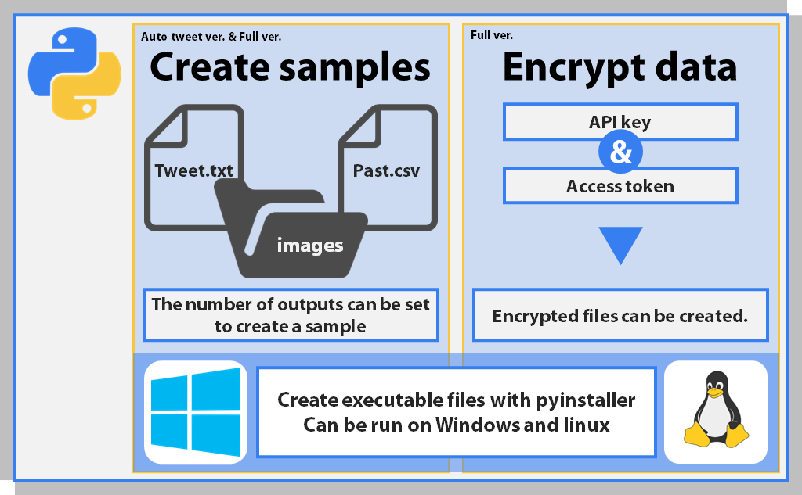

# Introduction

I'm not good at English. There may be parts that are difficult to understand. In that case, please feel free to ask me questions.

# Twitter-Bot Free Ver.

By uploading this folder to Heroku, you can automatically tweets.

# DEMO

The image is from "Full Ver.". In "Free Ver.", Only limited TwitterUtil.post () can be used.



# Features

By instantiating the TwitterUtil class of "Full Ver.", you can automatically tweet and like automatically.

")

")

By using BlockingScheduler, it can be executed at a specified time (±　x second is also possible). The interval of the execution time can also be set.



Executable file to create a sample folder and executable file to encrypt API key and access token have been created with pyinstaller.
It is available for Windows and Linux.



# Requirement

* Python 
* APScheduler
* bottle
* datetime
* numpy
* pycryptodome
* python-twitter

# Preparation

There are three things to do before using Twitter-bot. First, install [Git](https://git-scm.com/). Next, get your API key and access token from [Twitter app](https://apps.twitter.com/). Finally, go to [Heroku](https://dashboard.heroku.com/) and create an account.

Paste the API key and access token obtained from [Twitter app](https://apps.twitter.com/) into API_Key, Access_Token in the config folder.

In the case of  Full Ver., execute create-api-token or create-api-token.exe in the encrypt folder to encrypt the API key and access token. The encrypted file will be created automatically.

# Usage

Create an APP on Heroku and upload the folder with the following command.

If you want to upload changes, it is easier to run the update file.

```bash
cd Twitter-bot-Full

# First deployment
heroku login
$appname = Twitter-bot-001
heroku create $appname

git add .
git commit -m "new commit"
git remote add heroku https://git.heroku.com/$appname.git
git push heroku master

# Deploying the second and subsequent times
heroku login
update.bat   # windows
update.sh    # linux
```

# Installation

If you want to improve the source code, please install the library with the following command.

```bash
# pip
pip install -y APScheduler, bottle, datetime, numpy, pycryptodome, python-twitter

or

# conda
conda create -y twitter
conda activate twitter
conda install -y APScheduler, bottle, datetime, numpy, pycryptodome, python-twitter
conda deactivate
```

# Note

* Do not delete the white space for API_Key and Access_Token in the config folder. It will cause an error when loading.

# Author

* [Github DriCro6663](https://github.com/DriCro6663)
* [Twitter Dri_Cro_6663](https://twitter.com/Dri_Cro_6663)
* [PieceX DriCro6663]()
* [Dri-Cro's Memorandum](https://dri-cro-6663.jp/)
* dri.cro.6663@gmail.com

# License

Please check the [LICENSE](./LICENSE) file.